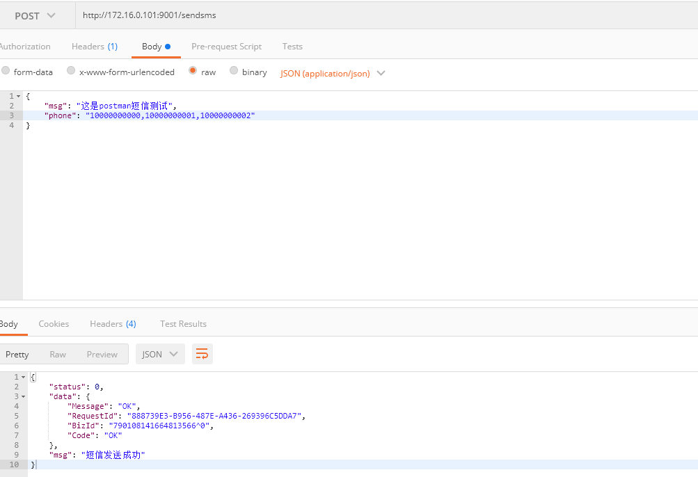
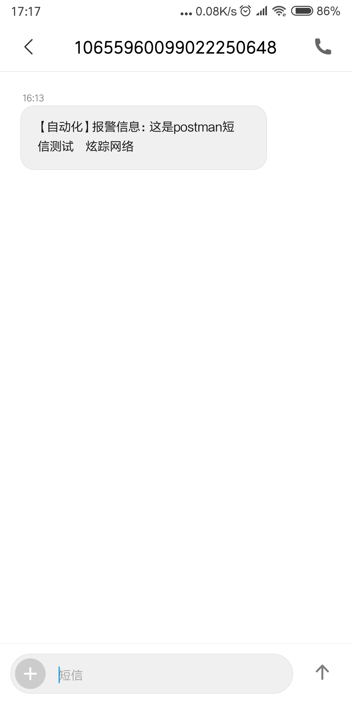

Table of Contents
=================

   * [Table of Contents](#table-of-contents)
   * [AppTools](#apptools)
      * [使用须知](#使用须知)
      * [Email](#email)
         * [API接口](#api接口)
            * [POST示例](#post示例)
            * [返回结果](#返回结果)
            * [效果图](#效果图)
      * [SMS(阿里大鱼)](#sms阿里大鱼)
         * [API接口](#api接口-1)
         * [请求示例](#请求示例)
      * [FAQ](#faq)


# AppTools
> 提醒工具API（如：邮箱、阿里大鱼、钉钉、微信），可通过POST请求调用，示例请参考`test.py`脚本，目前只写了邮箱

## 使用须知
- 使用人员请先修改`settings.py`配置信息
- 此环境配置信息统一调用接口`http://172.16.0.101:9000/app_settings`


## Email

- 目前测试支持QQ邮箱、腾讯企业邮箱、网易163邮箱、Gmail邮箱
- 常用邮件设置见`FAQ`介绍


### API接口
- URL：http://172.16.0.101:9001/sendmail
- 请求方式：POST

#### POST示例
- 使用`requests.post`请求

示例脚本
```python
#!/usr/bin/env python
# -*- coding: utf-8 -*-
# @Time    : 2018/11/6 17:59
# @Author  : Fred Yang
# @File    : test.py
# @Role    : 邮件测试脚本示例

import json
import requests

api = 'http://172.16.0.101:9001/sendmail'


def simple_mail():
    """plain格式邮件，最简单的模式，没有格式"""
    payload = {
        "to_list": "yanghongfei@shinezone.com",
        "subject": "这里是标题",
        "content": "这里是内容",
        "subtype": "plain",
        "att": "None"  # 没有附件就写None
    }

    r = requests.post(api, data=json.dumps(payload))
    print(r.text)


def att_html():
    """带附件邮件示例"""
    payload = {
        "to_list": "yanghongfei@shinezone.com,1923671815@qq.com",
        "subject": "这里是标题",
        "content": "这里是内容",
        "subtype": "plain",
        "att": "requirements.txt"  # 脚本当前路径下查找，找不到则报错
    }

    r = requests.post(api, data=json.dumps(payload))
    data = json.loads(r.text)
    print(data)


def html_mail():
    """构建HTML邮件示例"""
    content = """
            <!DOCTYPE html><html>
            <head lang="en">
            <meta charset="UTF-8">
            <title></title>
            <style type="text/css">
                p {
                    width: 100%;
                    margin: 30px 0 30px 0;
                    height: 30px;
                    line-height: 30px;
                    text-align: center;
                }
                table {
                    width: 100%;
                    text-align: center;
                    border-collapse: collapse;
                }
                tr.desc {
                    background-color: gray;
                    height: 30px;
                }
                tr.desc td {
                    border-color: #ffffff;
                }
                td {
                    height: 30px;
                    border: 1px solid gray;
                }
            </style>
            </head>
            <body>"""

    content += """
            <table>
            <p>HTML邮件示例 </p>
            <tr class='desc'>
            <td>事件名称</td>
            <td>事件内容</td>
            <td>过期时间</td>

            </tr>"""

    content += """
            <tr>
            <td>{}</td>
            <td>{}</td>
            <td>{}</td>
             </tr>""".format('event.name', 'event.content', 'event.expire_at')
    content += """
             </table>
             </body>
             </html>"""

    payload = {
        "to_list": "yanghongfei@shinezone.com,1923671815@qq.com",
        "subject": "这里是标题",
        "content": content,  # HTML构建出来的内容
        "subtype": "html",
        "att": "requirements.txt"  # 脚本当前路径下查找，找不到则报错
    }

    r = requests.post(api, data=json.dumps(payload))
    data = json.loads(r.text)
    print(data)


if __name__ == '__main__':
    simple_mail()
    html_mail()
    att_html()


```
#### 返回结果
```json
{
	'status': 0,
	'data': {
		'to_list': 'yanghongfei@shinezone.com,1923671815@qq.com',
		'subject': '这里是标题',
		'content': '这里是内容',
		'subtype': 'plain',
		'att': 'requirements.txt'
	},
	'msg': '发送成功'
}
```

#### 效果图

普通邮件带附件


HTML格式邮件带附件


## SMS(阿里大鱼)

> 注意事项： `const.py`修改对应的配置信息，如：ACCESS_KEY_ID, ACCESS_KEY_SECRET
修改`const.py`阿里大鱼的：签名、模板、电话等信息。

### API接口
- 支持阿里云短信服务(阿里大鱼)
- http://172.16.0.101:9001/sendsms
- 请求方式：POST
- 工具： POSTMAN

### 请求示例
```
#Body信息
{
	"msg": "这是postman短信测试",   #这里msg的值是要传入到阿里大鱼模板配置有个${msg}变量
	"phone": "10000000000,10000000001,10000000002" #电话号码多个用半角逗号隔离，不要有空格
}

```
- 返回结果
```json
{
    "status": 0,
    "data": {
        "Message": "OK",
        "RequestId": "888739E3-B956-487E-A436-269396C5DDA7",
        "BizId": "790108141664813566^0",
        "Code": "OK"
    },
    "msg": "短信发送成功"
}

```

- 效果图






## FAQ
> 由于常见的Email有很多，这里列举下最常见的Email设置

- Q: QQ邮箱怎么设置？
- A: QQ邮箱主要注意使用网页生成授权码进行作为密码登陆
    - [SMTP地址](https://service.mail.qq.com/cgi-bin/help?id=28&no=167&subtype=1)：smtp.qq.com
    - SMTP端口：465
    - SSL加密：True, 开启
    - 用   户: <your_qq>@qq.com
    - 密   码： 授权码（一般为16位）

- Q: 腾讯企业邮箱如何设置？
- A: 腾讯企业邮箱同QQ邮箱，唯一一点SMTP服务器不同
    - [SMTP地址](https://service.exmail.qq.com/cgi-bin/help?subtype=1&id=28&no=1000585)：smtp.exmail.qq.com
    - SMTP端口：465
    - SSL加密：True, 开启
    - 用   户: <your_name>@domain.com
    - 密   码： 授权码（一般为16位）

- Q: 网易163邮箱如何设置？
- A: 同上，唯一一点SMTP服务器不同
    - [SMTP地址](http://help.163.com/09/1223/14/5R7P3QI100753VB8.html)：smtp.163.com
    - SMTP端口：465
    - SSL加密：True, 开启
    - 用   户: <your_name>@163.com
    - 密   码： 授权码（一般为16位）

- Q: Gmail邮箱如何设置？
- A: Gmail邮箱考虑到安全，需要注意以下2步
  - 1. 首先开启Google 二步认证
  - 2. [生成Google 应用专用密码](https://support.google.com/mail/answer/185833?hl=zh-Hans)
    - [SMTP地址](https://support.google.com/mail/answer/7126229?hl=zh-Hans&visit_id=636771670247559816-1235179449&rd=2)：smtp.gmail.com
    - SMTP端口：465
    - SSL加密：True, 开启
    - 用   户: <your_name>@gmail.com
    - 密   码： 授权码（一般为16位）


