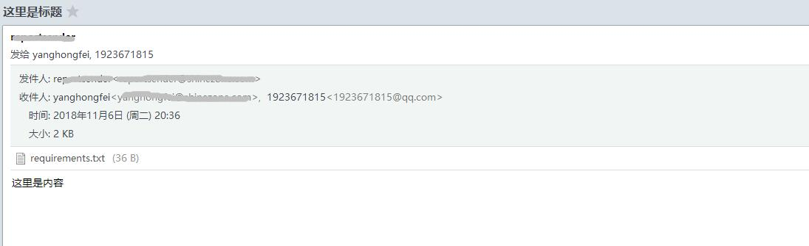
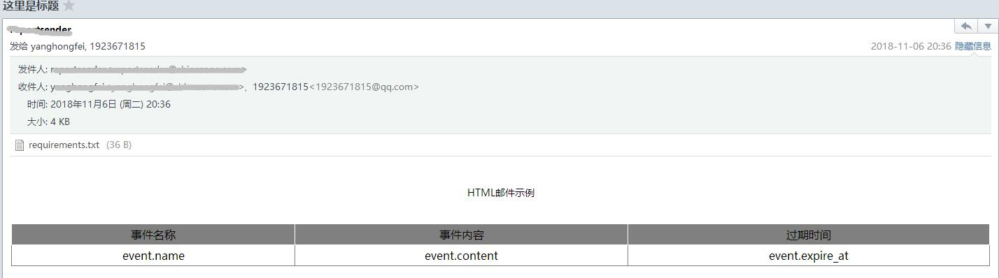

### AppTools
> 提醒工具API（如：邮箱、阿里大鱼、钉钉、微信），可通过POST请求调用，示例请参考`test.py`脚本，目前只写了邮箱

- 使用人员请先修改`settings.py`配置信息
- 此环境配置信息统一调用接口`http://172.16.0.101:9000/app_settings`


#### API接口
- URL：http://172.16.0.101:9001/sendmail
- 请求方式：POST

##### POST示例
- 使用`requests.post`请求

示例脚本
```python
#!/usr/bin/env python
# -*- coding: utf-8 -*-
# @Time    : 2018/11/6 17:59
# @Author  : Fred Yang
# @File    : test.py
# @Role    : 邮件测试脚本示例

import json
import requests

api = 'http://172.16.0.101:9001/sendmail'


def simple_mail():
    """plain格式邮件，最简单的模式，没有格式"""
    payload = {
        "to_list": "yanghongfei@shinezone.com",
        "subject": "这里是标题",
        "content": "这里是内容",
        "subtype": "plain",
        "att": "None"  # 没有附件就写None
    }

    r = requests.post(api, data=json.dumps(payload))
    print(r.text)


def att_html():
    """带附件邮件示例"""
    payload = {
        "to_list": "yanghongfei@shinezone.com,1923671815@qq.com",
        "subject": "这里是标题",
        "content": "这里是内容",
        "subtype": "plain",
        "att": "requirements.txt"  # 脚本当前路径下查找，找不到则报错
    }

    r = requests.post(api, data=json.dumps(payload))
    data = json.loads(r.text)
    print(data)


def html_mail():
    """构建HTML邮件示例"""
    content = """
            <!DOCTYPE html><html>
            <head lang="en">
            <meta charset="UTF-8">
            <title></title>
            <style type="text/css">
                p {
                    width: 100%;
                    margin: 30px 0 30px 0;
                    height: 30px;
                    line-height: 30px;
                    text-align: center;
                }
                table {
                    width: 100%;
                    text-align: center;
                    border-collapse: collapse;
                }
                tr.desc {
                    background-color: gray;
                    height: 30px;
                }
                tr.desc td {
                    border-color: #ffffff;
                }
                td {
                    height: 30px;
                    border: 1px solid gray;
                }
            </style>
            </head>
            <body>"""

    content += """
            <table>
            <p>HTML邮件示例 </p>
            <tr class='desc'>
            <td>事件名称</td>
            <td>事件内容</td>
            <td>过期时间</td>

            </tr>"""

    content += """
            <tr>
            <td>{}</td>
            <td>{}</td>
            <td>{}</td>
             </tr>""".format('event.name', 'event.content', 'event.expire_at')
    content += """
             </table>
             </body>
             </html>"""

    payload = {
        "to_list": "yanghongfei@shinezone.com,1923671815@qq.com",
        "subject": "这里是标题",
        "content": content,  # HTML构建出来的内容
        "subtype": "html",
        "att": "requirements.txt"  # 脚本当前路径下查找，找不到则报错
    }

    r = requests.post(api, data=json.dumps(payload))
    data = json.loads(r.text)
    print(data)


if __name__ == '__main__':
    simple_mail()
    html_mail()
    att_html()


```
- 返回结果
```json
{
	'status': 0,
	'data': {
		'to_list': 'yanghongfei@shinezone.com,1923671815@qq.com',
		'subject': '这里是标题',
		'content': '这里是内容',
		'subtype': 'plain',
		'att': 'requirements.txt'
	},
	'msg': '发送成功'
}
```

- 效果图

普通邮件带附件


HTML格式邮件带附件
