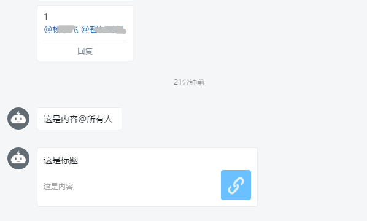
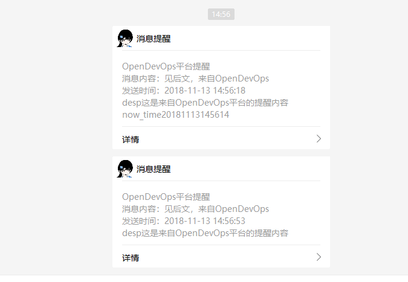

Table of Contents
=================

   * [Table of Contents](#table-of-contents)
   * [AppTools](#apptools)
      * [使用须知](#使用须知)
      * [部署使用](#部署使用)
      * [Email](#email)
         * [API接口](#api接口)
            * [POST示例](#post示例)
            * [效果图](#效果图)
      * [SMS(阿里大鱼)](#sms阿里大鱼)
         * [API接口](#api接口-1)
            * [POST示例](#post示例-1)
            * [返回结果](#返回结果)
            * [效果图](#效果图-1)
      * [钉钉DingTalk](#钉钉dingtalk)
         * [API接口](#api接口-2)
            * [POST示例](#post示例-2)
               * [普通文本格式](#普通文本格式)
               * [Link超链接格式](#link超链接格式)
         * [效果图](#效果图-2)
      * [微信Wechat](#微信wechat)
         * [环境说明](#环境说明)
         * [API接口](#api接口-3)
            * [POST示例](#post示例-3)
            * [返回结果](#返回结果-1)
            * [效果图](#效果图-3)
      * [故障管理](#故障管理)
         * [表结构](#表结构)
         * [API接口](#api接口-4)
            * [GET示例](#get示例)
            * [POST示例](#post示例-4)
            * [PUT示例](#put示例)
            * [DELETE示例](#delete示例)
            * [返回结果](#返回结果-2)
      * [事件提醒](#事件提醒)
         * [表结构](#表结构-1)
         * [API接口](#api接口-5)
            * [GET示例](#get示例-1)
            * [POST示例](#post示例-5)
            * [PUT示例](#put示例-1)
            * [DELETE示例](#delete示例-1)
            * [返回结果](#返回结果-3)
      * [FAQ](#faq)
      * [更新日志](#更新日志)      * [更新日志](#更新日志)


# AppTools
> 工具API（如：邮箱、阿里大鱼、钉钉、微信），可通过POST请求调用，只有后端逻辑，没有Web界面

## 使用须知
- 使用人员请先修改`settings.py` 和`const`常量基本配置信息
- 此环境配置信息统一调用接口`http://172.16.0.101:9000/app_settings`


## 部署使用
```
$ git clone https://github.com/yanghongfei/AppTools.git
#记得修改`settings.py` 和`const`常量基本配置信息
$ 安装依赖 pip3 install -r requirements.txt
$ python3 app.py
```
**Docker方式**
- 请修改对应settings里面的内容
- 首先要具有docker环境，docker推荐使用`docker-ce`
- 进入到项目目录，制作镜像启动
```bash
docker build -t apptools .
docker-compose up -d
```

## Email

- 目前测试支持QQ邮箱、腾讯企业邮箱、网易163邮箱、Gmail邮箱
- 常用邮件设置见`FAQ`介绍


### API接口
- URL：http://172.16.0.101:9001/sendmail
- 请求方式：POST

#### POST示例
- 使用`requests.post`请求

示例脚本 请参考：`test.py`
```
#### 返回结果
​```json
{
	'status': 0,
	'data': {
		'to_list': 'yanghongfei@shinezone.com,1923671815@qq.com',
		'subject': '这里是标题',
		'content': '这里是内容',
		'subtype': 'plain',
		'att': 'requirements.txt'
	},
	'msg': '发送成功'
}
```

#### 效果图

普通邮件带附件


HTML格式邮件带附件


## SMS(阿里大鱼)

> 注意事项： `const.py`修改对应的配置信息，如：ACCESS_KEY_ID, ACCESS_KEY_SECRET
修改`const.py`阿里大鱼的：签名、模板、电话等信息。

### API接口
- 支持阿里云短信服务(阿里大鱼)
- http://172.16.0.101:9001/sendsms
- 请求方式：POST
- 工具： POSTMAN

#### POST示例
```
#Body信息
{
	"msg": "这是postman短信测试",   #这里msg的值是要传入到阿里大鱼模板配置有个${msg}变量
	"phone": "10000000000,10000000001,10000000002" #电话号码多个用半角逗号隔离，不要有空格
}

```
#### 返回结果
```json
{
    "status": 0,
    "data": {
        "Message": "OK",
        "RequestId": "888739E3-B956-487E-A436-269396C5DDA7",
        "BizId": "790108141664813566^0",
        "Code": "OK"
    },
    "msg": "短信发送成功"
}

```

#### 效果图


## 钉钉DingTalk
> 企业DingTalk机器人消息通知, 请先获取WebHook, 然后修改对应`const.py`WebHook地址

- 资料：
    - [DingTalk机器人申请地址](https://open-doc.dingtalk.com/docs/doc.htm?spm=0.0.0.0.0Sds7z&treeId=257&articleId=105733&docType=1)
    - [参考官方使用示例](https://open-doc.dingtalk.com/docs/doc.htm?spm=0.0.0.0.0Sds7z&treeId=257&articleId=105733&docType=1)


### API接口
- http://172.16.0.101:9001/send_dingtalk
- 请求方式：POST
- 工具： POSTMAN

#### POST示例

##### 普通文本格式
- Body信息
```
{
	"msgtype": "text",
	"content": "这是内容",
	"title": "这是标题",
	"phone": "10000000000,10000000001,10000000002", #电话号码多个用半角逗号隔离，不要有空格
	"is_at_all": "False"
}
```

- 参数介绍
- msgtype: text, 普通文本格式
- content: 文本内容
- tilte: 标题
- phone: 被@人的电话号码，比如机器人是在一个群里，这个号码必须是群里某一个人员的电话，没有则None
- is_at_all: True则@全员，False不进行@全员

- 返回结果
```json
{
    "status": 0,
    "data": {
        "msgtype": "text",
        "content": "这是内容",
        "title": "这是标题",
        "phone": "10000000000,10000000001,10000000002",
        "is_at_all": "True"
    },
    "datetime": "2018-11-12 17:42:59",
    "msg": "OK"
}
```

##### Link超链接格式

- Body信息
```
{
	"msgtype": "link",
	"content": "这是内容",
	"title": "这是标题",
	"phone": "None",
	"url": "https://www.google.com",
	"is_at_all": "True"
}
```
- 参数介绍
- msgtype: link, 超链接格式
- content: 文本内容
- tilte: 标题
- url : 超链接URL地址
- phone: 被@人的电话号码，比如机器人是在一个群里，这个号码必须是群里某一个人员的电话，没有则None
- is_at_all: True则@全员，False不进行@全员


- 返回结果
```json

{
    "status": 0,
    "data": {
        "msgtype": "link",
        "content": "这是内容",
        "title": "这是标题",
        "phone": "None",
        "url": "https://www.google.com",
        "is_at_all": "True"
    },
    "datetime": "2018-11-12 17:56:00",
    "msg": "OK"
}

```

### 效果图



## 微信Wechat
> 微信消息通知
### 环境说明
- pushbear地址：`http://pushbear.ftqq.com/admin/#/api` 附有使用说明和API说明

- 为什么使用pushbear
  - 1. 使用微信通知方式有：微信服务号、订阅号、企业号
  - 2. 服务号、企业号、需要企业证明，营业执照等，很不方便
  - 3. 订阅号每天自能发送一条订阅消息，发送数量太小
  - 4. 使用个人微信进行发送信息，wxpy模块，但是网页端口不稳定/被禁用了，无非使用

> 以上，搞起来很麻烦，不如使用pushbear（外面共有的API接口），一天1000条消息，简单方便免费，已使用半年。


### API接口
- http://172.16.0.101:9001/send_wechat
- 请求方式：POST
- 工具： POSTMAN

#### POST示例

- Body信息
```
{
	"text": "OpenDevOps平台提醒",
	"desp": "这是来自OpenDevOps平台的提醒内容"
}
```

- 参数介绍
- text: 标题，必填。不超过80个字
- desp: 长文本内容，选填。用户通过点击短信里的链接，打开浏览器阅读。支持Markdown语法，不超过64K


#### 返回结果
```json
{
    "status": 0,
    "data": {
        "text": "OpenDevOps平台提醒",
        "desp": "这是来自OpenDevOps平台的提醒内容"
    },
    "datetime": "2018-11-13 14:56:45",
    "msg": "OK"
}
```
#### 效果图



## 故障管理
> 故障管理后端代码，接入DevOps记录故障信息

### 表结构
```mysql
+-------------------+--------------+------+-----+-------------------+-----------------------------+
| Field             | Type         | Null | Key | Default           | Extra                       |
+-------------------+--------------+------+-----+-------------------+-----------------------------+
| id                | int(11)      | NO   | PRI | NULL              | auto_increment              |
| fault_name        | varchar(100) | NO   |     | NULL              |                             |
| fault_level       | int(11)      | NO   |     | NULL              |                             |
| fault_state       | int(11)      | NO   |     | NULL              |                             |
| fault_penson      | varchar(100) | NO   |     | NULL              |                             |
| processing_penson | varchar(100) | YES  |     | NULL              |                             |
| fault_report      | longtext     | YES  |     | NULL              |                             |
| fault_start_time  | datetime     | NO   |     | NULL              |                             |
| fault_end_time    | datetime     | NO   |     | NULL              |                             |
| fault_duration    | varchar(100) | YES  |     | NULL              |                             |
| fault_issue       | varchar(100) | YES  |     | NULL              |                             |
| fault_summary     | varchar(100) | YES  |     | NULL              |                             |
| create_at         | datetime     | NO   |     | NULL              |                             |
| update_at         | timestamp    | NO   |     | CURRENT_TIMESTAMP | on update CURRENT_TIMESTAMP |
+-------------------+--------------+------+-----+-------------------+-----------------------------+

```
- 字段说明
```mysql
    id = Column(Integer, primary_key=True, autoincrement=True)  # ID 自增长
    fault_name = Column(String(100), nullable=False)  # 故障名称
    fault_level = Column(Integer, nullable=False)  # 故障级别,1,2,3,4为故障等级
    fault_state = Column(Integer, nullable=False)  # 故障状态，0:关闭 1：进行中
    fault_penson = Column(String(100), nullable=False)  # 故障责任人
    processing_penson = Column(String(100), nullable=True)  # 故障处理人员
    fault_report = Column(LONGTEXT, nullable=True)  # 故障报告 HTTPS链接，附件
    fault_start_time = Column(DateTime, nullable=False)  # 故障开始时间
    fault_end_time = Column(DateTime, nullable=False)  # 故障结束时间
    fault_duration = Column(String(100), nullable=True)  # 故障影响时间，分钟
    fault_issue = Column(String(100), nullable=True)  # 故障原因
    fault_summary = Column(String(100), nullable=True)  # 故障总结
    create_at = Column(DateTime, nullable=False, default=datetime.now())  # 记录创建时间
    update_at = Column(TIMESTAMP, nullable=False, default=datetime.now())  # 记录更新时间
```


### API接口
- http://172.16.0.101:9001/fault
- 支持：GET/POST/PUT/DELETE
- 测试工具： POSTMAN RAW数据
####  GET示例
- http://172.16.0.101:9001/fault #获取所有故障信息

#### POST示例
```
#Body信息
{
	"fault_name": "test011",
	"fault_level": "1",
	"fault_state": "1",
	"fault_penson": "杨红飞",
	"processing_penson": "杨红飞、OPS组",
	"fault_report": "https://opendevops.cn/fault_report/test0011.html",
	"fault_start_time": "2018-11-22",
	"fault_end_time": "2018-11-23",
	"fault_issue": "AWS底层重test启",
	"fault_summary": "故障总结"
}
```

#### PUT示例

```
{
	"fault_name": "test011", #除了name，其余都可以修改更新
	"fault_level": "1",
	"fault_state": "1",
	"fault_penson": "杨红飞",
	"processing_penson": "杨红飞test、OPS组",
	"fault_report": "https://opendevops.cn/fault_report/test0011.html",
	"fault_start_time": "2018-11-22",
	"fault_end_time": "2018-11-23",
	"fault_issue": "AWS底层重test启",
	"fault_summary": "故障总结test"
}
```


#### DELETE示例

```
{
	"fault_name": "test011", #删除name
}

```
#### 返回结果

```json
{
    "status": 0,
    "data": {
        "fault_name": "test0112",
        "fault_level": "1",
        "fault_state": "1",
        "fault_penson": "杨红飞",
        "processing_penson": "杨红飞、OPS",
        "fault_report": "https://opendevops.cn/fault_report/test0011.html",
        "fault_start_time": "2018-11-22",
        "fault_end_time": "2018-11-23",
        "fault_issue": "AWS底层重test启",
        "fault_summary": "故障总结"
    },
    "datetime": "2018-11-22 18:22:25",
    "msg": "Name: test0112 添加成功"
}
```


## 事件提醒
> 事件提醒Tornado后端代码逻辑，配合前端可以，手动添加需要提醒的事件，可以帮助你进行Email提前提醒
> 其余人员使用注意：`settings.py`和`utils/const.py`信息

### 表结构
```mysql
+------------+--------------+------+-----+-------------------+-----------------------------+
| Field      | Type         | Null | Key | Default           | Extra                       |
+------------+--------------+------+-----+-------------------+-----------------------------+
| id         | int(11)      | NO   | PRI | NULL              | auto_increment              |
| name       | varchar(100) | YES  |     | NULL              |                             |
| content    | varchar(100) | YES  |     | NULL              |                             |
| email      | varchar(100) | YES  |     | NULL              |                             |
| advance_at | int(11)      | YES  |     | NULL              |                             |
| expire_at  | datetime     | YES  |     | NULL              |                             |
| create_at  | datetime     | NO   |     | NULL              |                             |
| update_at  | timestamp    | NO   |     | CURRENT_TIMESTAMP | on update CURRENT_TIMESTAMP |
+------------+--------------+------+-----+-------------------+-----------------------------+
```

**字段介绍**
- ID: 自增长
- name: 事件名称
- content: 事件内容描述
- Email： 需要通知人员的Email地址
- advance: 提前多少天进行提醒
- expire_at: 事件过期/到期时间
- create_at: 记录事件创建时间
- update_at: 记录事件更新时间

### API接口
- http://172.16.0.101:9001/event_reminder
- 工具：POSTMAN
- 支持：GET/POST/PUT/DELETE

#### GET示例
```
curl -X GET http://172.16.0.101:9001/event_reminder
```

#### POST示例
```
{
    "name": "Ec2",
    "content": "服务器到期提醒",
    "email": "1923671815@qq.com, xxxxx@qq.com",
    "advance_at": "100",
    "expire_at": "2018-11-30"
}
```
#### PUT示例
```
{
    "name": "Ec2",   #name可读，其余信息都可以修改
    "content": "这是修改后的服务器信息提醒",
    "email": "1923671815@qq.com, group@qq.com",
    "advance_at": "50",
    "expire_at": "2018-12-30"
}
```
#### DELETE示例
```
删除只需要填写name
{
    "name": "域名"
}
```

#### 返回结果
```
{
    "status": 0,
    "data": {
        "name": "域名",
        "content": "这是域名将要到期提醒",
        "email": "1923671815@qq.com, xxxx@qq.com",
        "advance_at": "10",
        "expire_at": "2018-11-30"
    },
    "datetime": "2018-11-23 13:48:10",
    "msg": "添加成功"
}
```

## FAQ
> 由于常见的Email有很多，这里列举下最常见的Email设置

- Q: QQ邮箱怎么设置？
- A: QQ邮箱主要注意使用网页生成授权码进行作为密码登陆
    - [SMTP地址](https://service.mail.qq.com/cgi-bin/help?id=28&no=167&subtype=1)：smtp.qq.com
    - SMTP端口：465
    - SSL加密：True, 开启
    - 用   户: <your_qq>@qq.com
    - 密   码： 授权码（一般为16位）


- Q: 腾讯企业邮箱如何设置？
- A: 腾讯企业邮箱同QQ邮箱，唯一一点SMTP服务器不同
    - [SMTP地址](https://service.exmail.qq.com/cgi-bin/help?subtype=1&id=28&no=1000585)：smtp.exmail.qq.com
    - SMTP端口：465
    - SSL加密：True, 开启
    - 用   户: <your_name>@domain.com
    - 密   码： 授权码（一般为16位）


- Q: 网易163邮箱如何设置？
- A: 同上，唯一一点SMTP服务器不同
    - [SMTP地址](http://help.163.com/09/1223/14/5R7P3QI100753VB8.html)：smtp.163.com
    - SMTP端口：465
    - SSL加密：True, 开启
    - 用   户: <your_name>@163.com
    - 密   码： 授权码（一般为16位）


- Q: Gmail邮箱如何设置？
- A: Gmail邮箱考虑到安全，需要注意以下2步
  - 1. 首先开启Google 二步认证
  - 2. [生成Google 应用专用密码](https://support.google.com/mail/answer/185833?hl=zh-Hans)
    - [SMTP地址](https://support.google.com/mail/answer/7126229?hl=zh-Hans&visit_id=636771670247559816-1235179449&rd=2)：smtp.gmail.com
    - SMTP端口：465
    - SSL加密：True, 开启
    - 用   户: <your_name>@gmail.com
    - 密   码： 授权码（一般为16位）


## 更新日志

**2018-11-07**

- 创建Apptool工具库
- 添加Email提醒  

**2018-11-10**

- 添加SMS 阿里大鱼提醒
- 添加钉钉提醒
- 添加微信提醒

**2018-11-22**

- 添加故障管理
- 添加单文件上传(很Low，最简单的)

**2018-11-23**

- 添加事件提醒
- Docker部署方式

